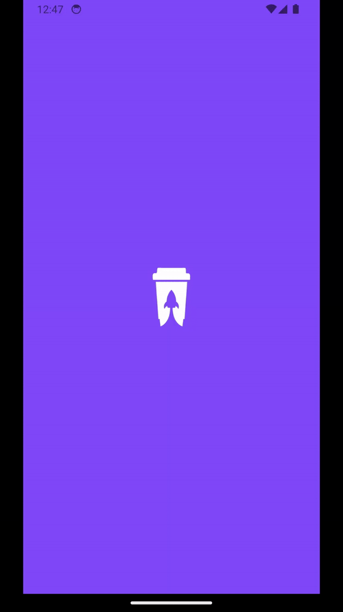

# Coffee Delivery - React Native

##  📄 Sobre o projeto

Este app simula um e-commerce de cafés. O objetivo da construção desse aplicativo foi criar animações interativas para o usuário, além de reforçar alguns aprendizados com o React Native, como, por exemplo, AsyncStorage, React Navigation, Context API e React Native Gesture Handler.

### 🎨 Splash Screen 

### 🏠 Home

### 📦 Produto

### 🛒 Carrinho

## Instruções para Executar o Projeto

1. Clone este repositório para o seu ambiente de desenvolvimento. 
``git clone https://github.com/YuriCruger/coffee-delivery-rn.git``
2. Navegue até o diretório do projeto.
3. Instale as dependências do projeto utilizando o comando `npm install`.
4. Execute a aplicação utilizando um emulador Android, ou em um dispositivo físico conectado, utilizando o comando `npx expo start`.
